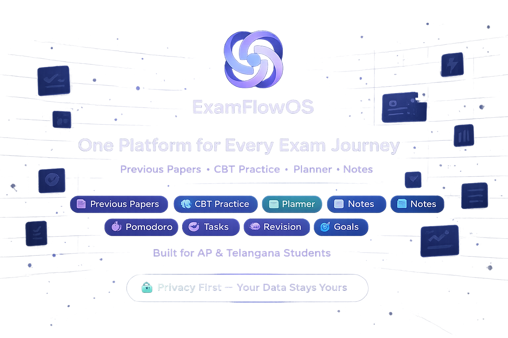
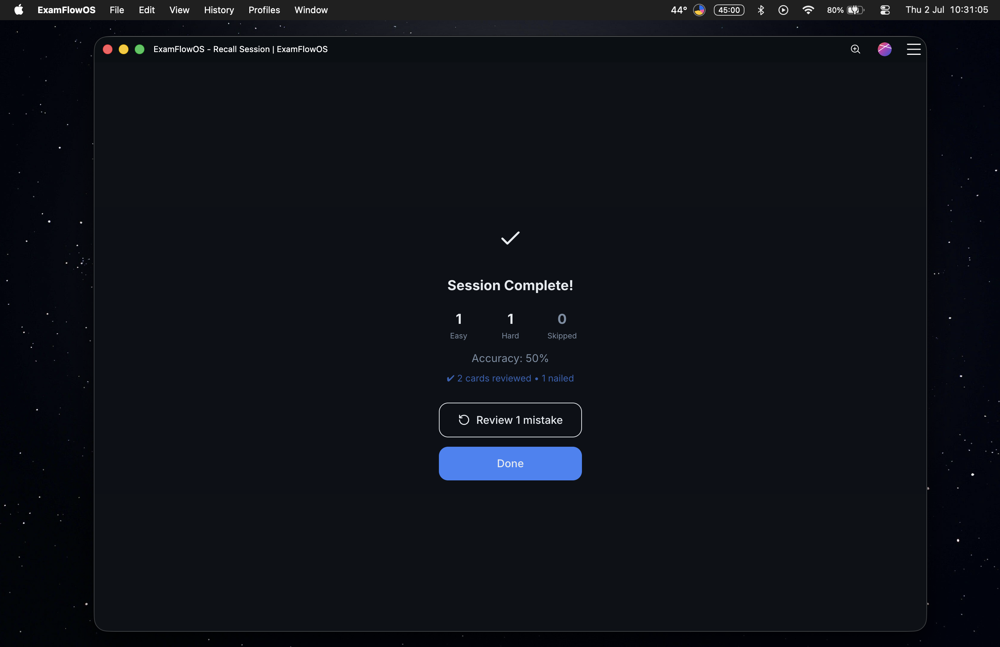
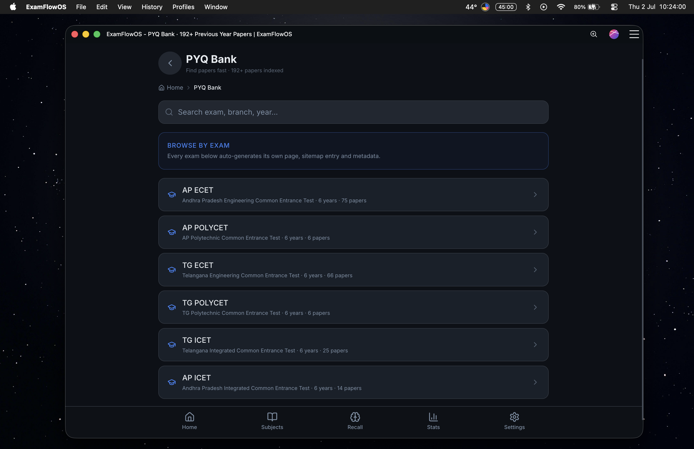
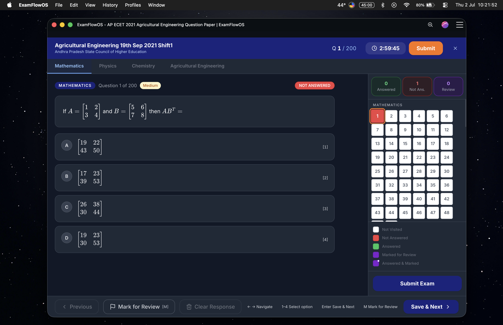
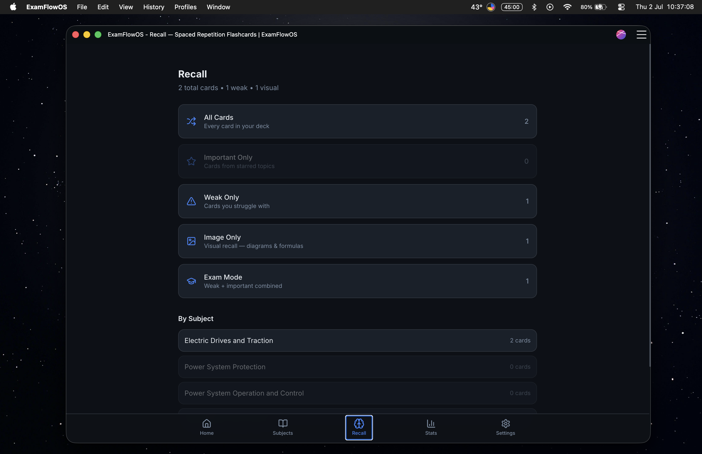
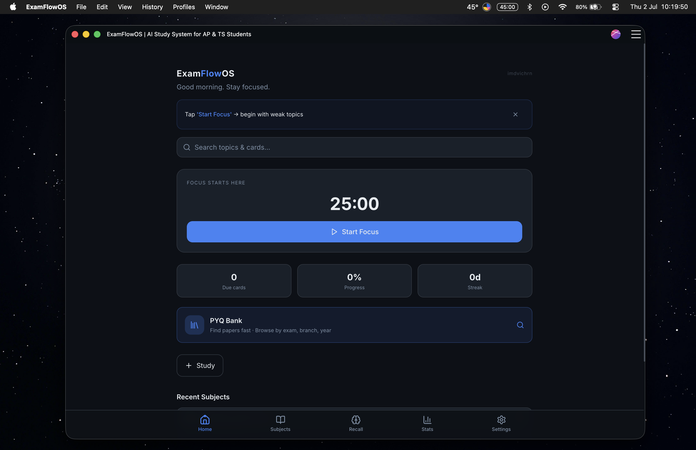
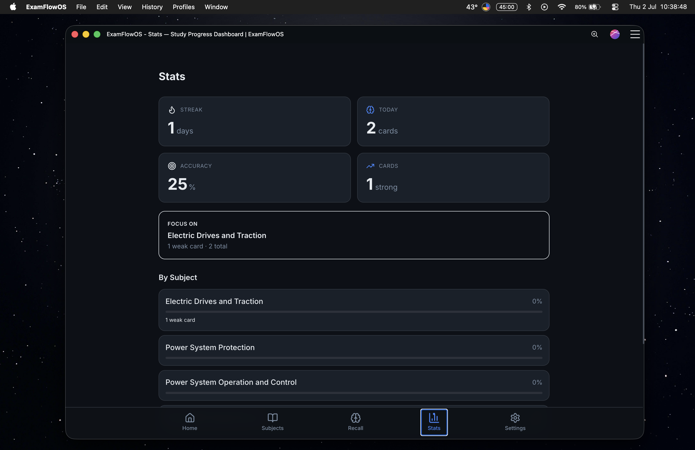
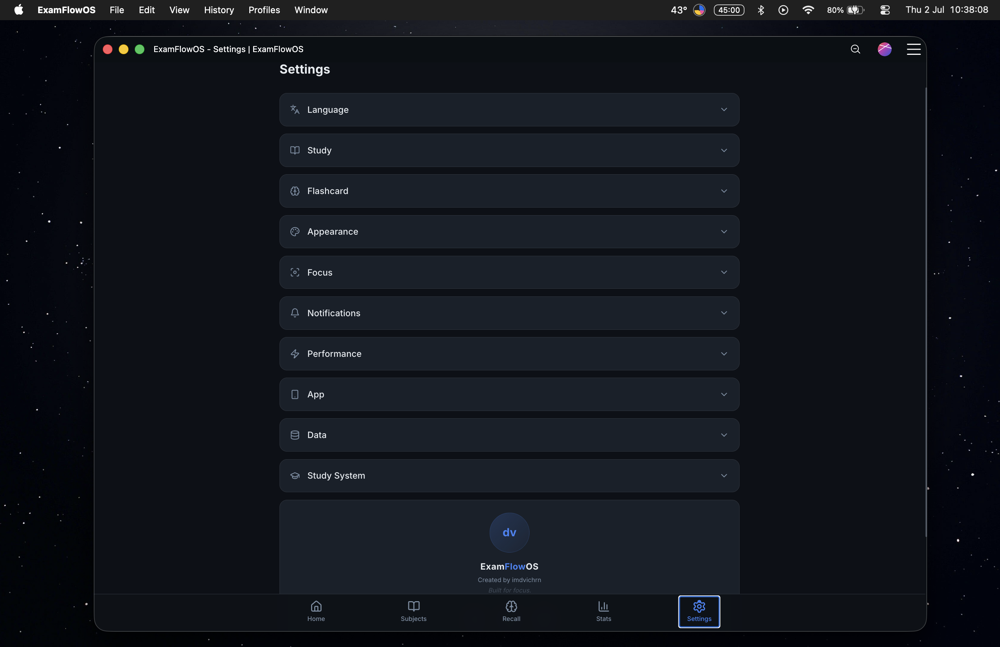

# ExamFlowOS

### The modern operating system for examination preparation

  <strong>Bring previous year papers, CBT practice, flashcards, active recall, focus sessions, and study analytics into one disciplined workflow.</strong>

  
  

  
  
  
  
  
  

---

  

---

## Table of Contents

- [Overview](#overview)
- [Why ExamFlowOS](#why-examflowos)
- [Core capabilities](#core-capabilities)
- [Platform experience](#platform-experience)
- [Screenshots](#screenshots)
- [Supported examinations](#supported-examinations)
- [Documentation](#documentation)
- [Roadmap](#roadmap)
- [Contributing](#contributing)
- [License](#license)

---

## Overview

ExamFlowOS is a modern preparation platform built for students who want to study with more structure, less friction, and better visibility into their progress. It brings previous year papers, CBT practice, flashcards, active recall, focus sessions, and study analytics into one connected experience so preparation feels more coherent and less fragmented.

Instead of switching between documents, timers, note tools, and revision apps, learners can stay within a single workflow from discovery to review.

---

## Why ExamFlowOS

Competitive exam preparation is often scattered across too many tools. Students may search for papers in one place, review notes in another, track revision manually, and rely on separate apps for flashcards or timers. That fragmentation wastes time and makes progress harder to sustain.

ExamFlowOS addresses that problem by offering a unified study environment designed around the realities of exam preparation. The platform helps students:

- organize their preparation in a clear structure
- practice in realistic exam-style conditions
- revisit concepts through active recall
- maintain focus with distraction-light study sessions
- track progress with measurable insights

The goal is simple: reduce the overhead of preparation so students can spend more time learning and less time managing tools.

---

## Core capabilities

| Capability | What it helps with |
| --- | --- |
| Previous Year Papers | Browse and review organized exam resources quickly |
| CBT Practice | Simulate computer-based testing in a realistic environment |
| Flashcards | Turn important concepts into reusable review cards |
| Active Recall | Strengthen long-term retention through guided review |
| Focus Mode | Create distraction-free study sessions |
| Study Statistics | Monitor consistency, progress, and preparation trends |
| Offline Support | Continue using key features even without connectivity |

### Product philosophy

ExamFlowOS is built around a few guiding principles:

- keep the experience simple and focused
- make learning resources easier to find and revisit
- support both practice and review in one flow
- respect student privacy and control over their data
- improve the platform through thoughtful iteration

---

## Platform experience

The experience is designed to feel like a complete study workspace rather than a collection of isolated utilities.

A typical preparation journey looks like this:

1. Choose an examination
2. Browse previous year papers
3. Preview or download the material
4. Practice through CBT when available
5. Create or review flashcards
6. Use recall sessions to reinforce memory
7. Track progress and maintain focus

That sequence creates a continuous learning loop that supports preparation from discovery to revision.

---

## Screenshots

  

  

  

  

  

  

  

  

  

  

---

## Supported examinations

ExamFlowOS is designed to support a growing set of examinations with a consistent structure for papers, subjects, and preparation workflows.

| Examination | Status |
| --- | --- |
| AP ECET | Supported |
| TG ECET | Supported |
| AP ICET | Supported |
| TG ICET | Supported |
| AP POLYCET | Supported |
| TG POLYCET | Supported |

More examinations can be added as the platform expands.

---

## Documentation

The public repository includes a compact documentation set for the product vision and structure:

- [docs/features.md](docs/features.md) — overview of the platform features
- [docs/supported-exams.md](docs/supported-exams.md) — supported exam categories
- [docs/architecture.md](docs/architecture.md) — architecture direction
- [docs/ai-reference.md](docs/ai-reference.md) — AI-assisted learning reference
- [docs/faq.md](docs/faq.md) — common questions and product context

---

## Roadmap

The roadmap focuses on building a reliable, student-centered preparation system that grows in capability over time.

- strengthen the core paper and study workflow
- expand CBT and practice experiences
- improve revision and recall systems
- add richer analytics and progress insight
- support future collaboration and educator workflows

---

## Contributing

Contributions are welcome. If you would like to improve the documentation, refine the product structure, or suggest new learning features, please review [CONTRIBUTING.md](CONTRIBUTING.md) first.

---

## License

ExamFlowOS is released under the [MIT License](LICENSE).
